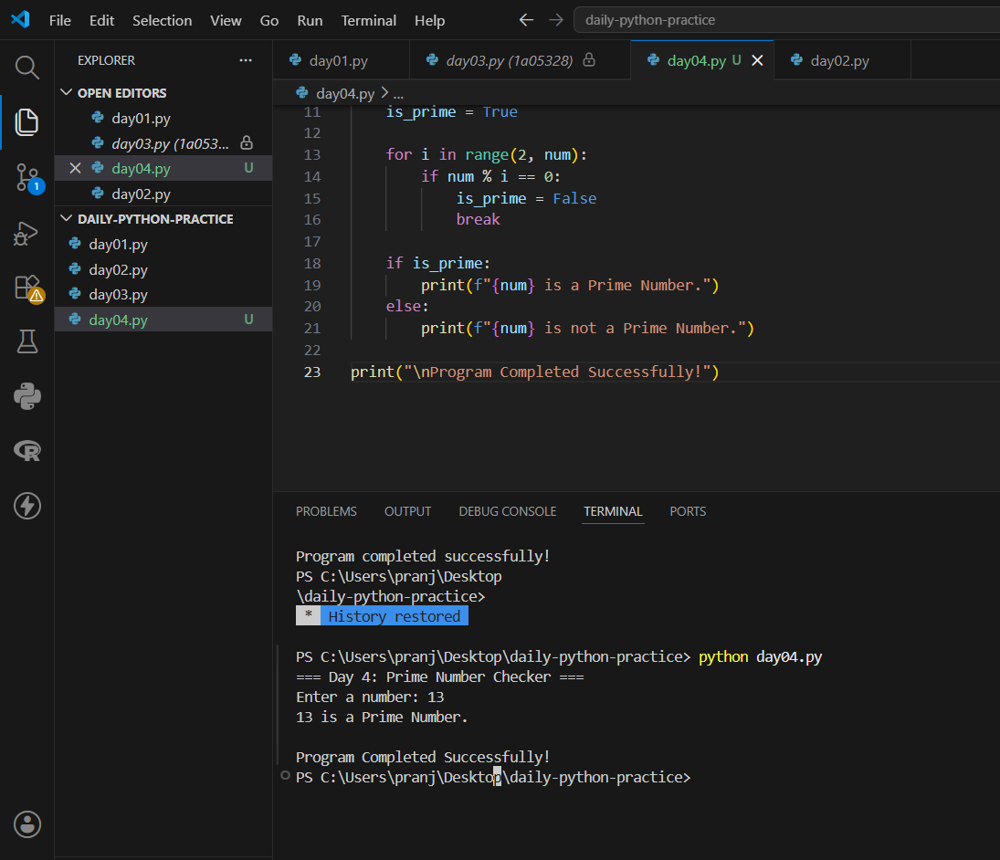
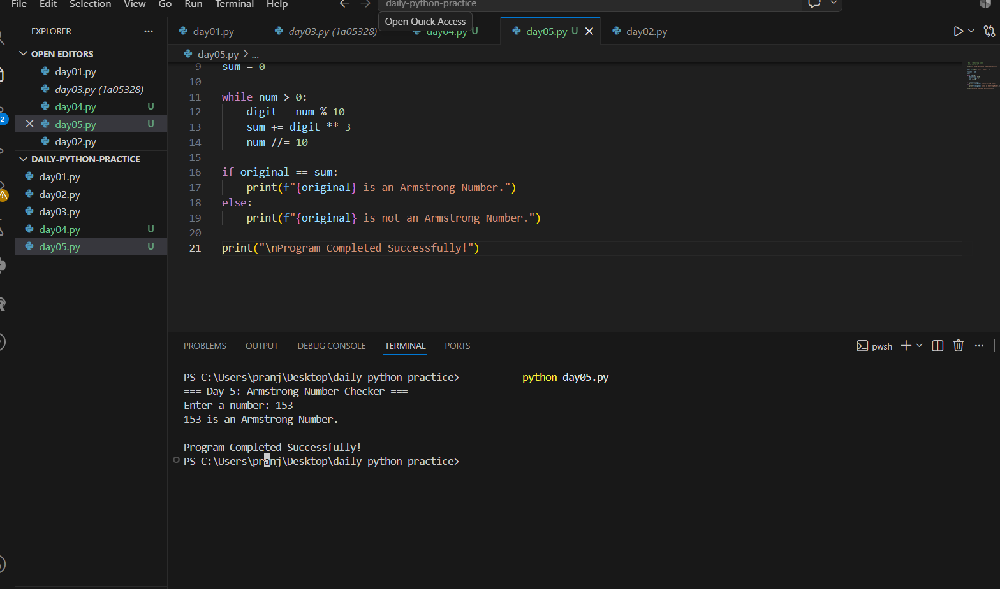
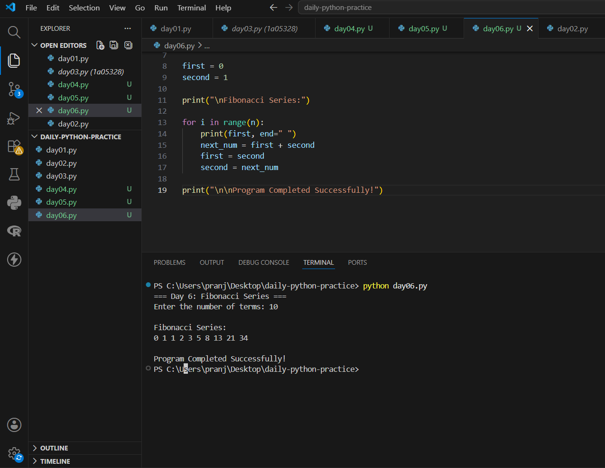
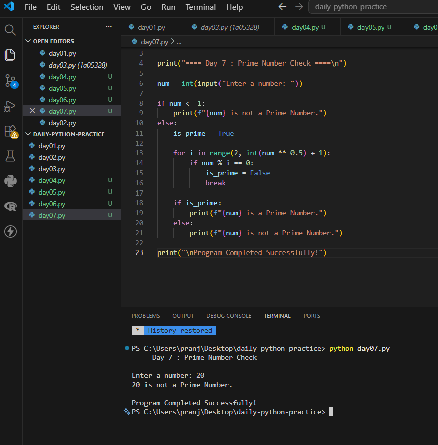
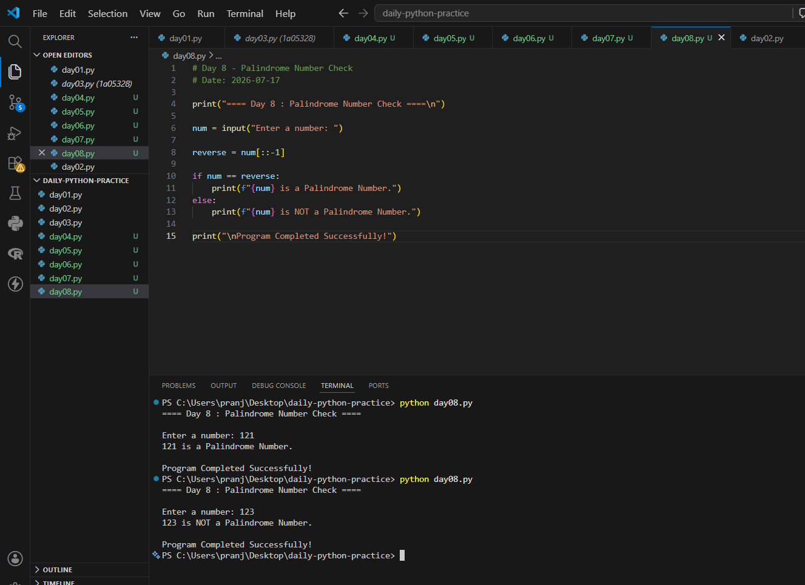
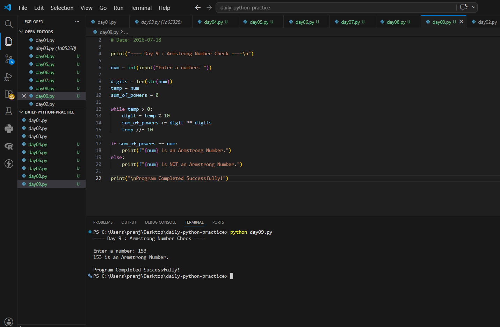

# daily-python-practice

My daily Python practice

## Day 1 – Variables and Basic Arithmetic

## Day 2 – Even or Odd Program
- Program: `day02.py`

## Day 3 - Largest of Three Numbers

- Program: `day03.py`
  

## Day 4 - Prime Number Checker

- Program: `day04.py`

## Day 5 - Armstrong Number Checker

- **Program:** `day05.py`

## Day 6 - Fibonacci Series

- **Program:** `day06.py`
- 

## Day 7 - Prime Number Check

- Program: `day07.py`
  

## Day 8 - Palindrome Number Check

- Program: `day08.py`
  
### Output

## Day 9 - Armstrong Number Check

- Program: `day09.py`
  
### Output

