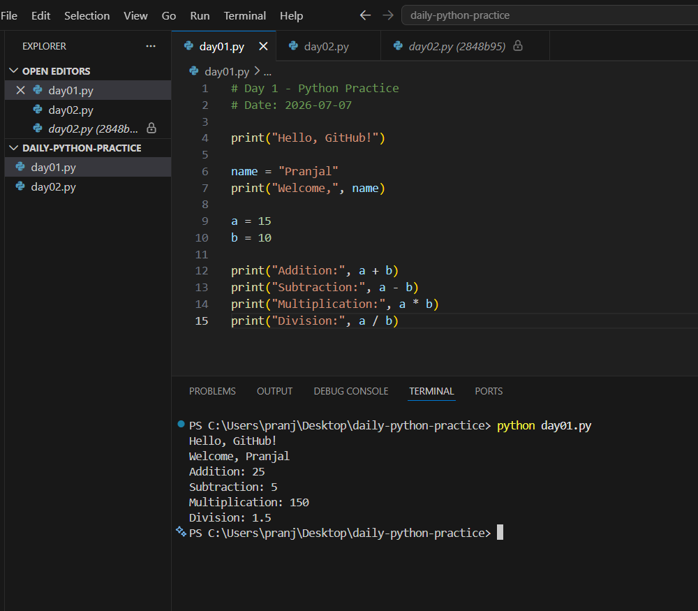
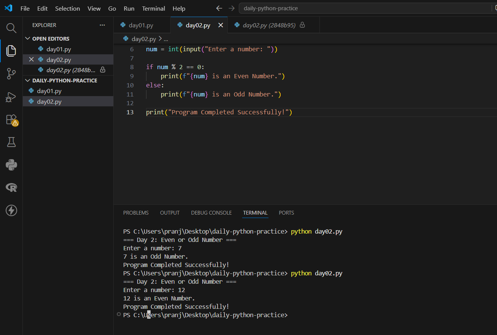
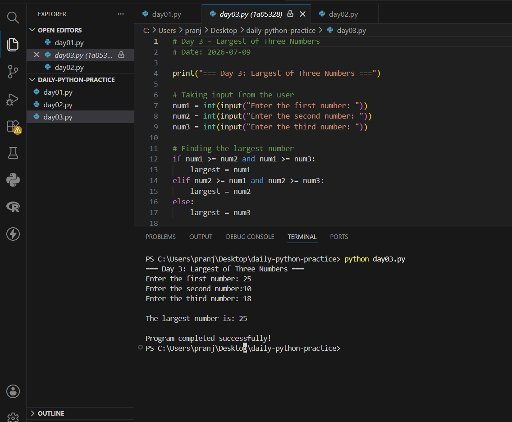

# daily-python-practice

My daily Python practice

## Day 1 – Variables and Basic Arithmetic

## Day 2 – Even or Odd Program
- Program: `day02.py`

## Day 3 - Largest of Three Numbers

- Program: `day03.py`

### Output

